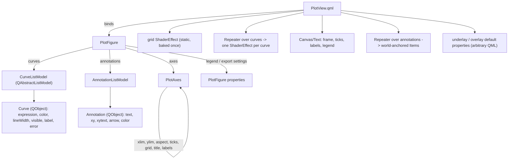

# API design — a Matplotlib-flavoured surface on Qt

Status: **decided** (this document overrides the earlier `aspect` design where it says so).
Audience: whoever adds multiple curves, axes, grid, annotations and custom elements next.

---

## 1. Principles

1. **Qt is the runtime, not a wrapper.** Every knob is a Qt `Property` with a `notify`
   signal; every collection is a `QAbstractListModel`; every action is a `Slot`. Changing a
   property emits exactly one signal and the QML re-renders — no Python call is needed to
   "update the plot", and nothing is mutated behind Qt's back.
2. **Expressions, not data.** A curve is `y = f(x)` evaluated *per pixel in a fragment
   shader*, not a polyline sampled on the CPU. This is the fundamental difference from
   Matplotlib and it drives everything below: an artist is a shader, "many curves" means
   several full-screen passes, and the cost is proportional to pixels × curves, never to
   the function's frequency.
3. **One world→screen transform, owned by the Axes.** Curves, grid, ticks, labels,
   annotations and exported images all read the same limits. Nothing keeps a private copy.
4. **The GPU draws curves and the grid; QML draws text and vector furniture** (ticks,
   labels, legend, annotations). Text in a shader is a dead end.
5. **Offscreen rendering is Qt's job** (`QQuickRenderControl`), not a second renderer: the
   export path instantiates the *same* QML component at the requested size, so what you
   export is what you see.

## 2. Object model



`PlotFigure` is a plain `QObject` (no QWidget, no window): the same figure can be shown in
a `QQuickView`, embedded with `MathPlotWidget`, or rendered offscreen for an export. The
model owns state; `PlotView.qml` owns pixels.

## 3. Python API (the Matplotlib-flavoured surface)

```python
from qmlmathplot import PlotFigure

fig = PlotFigure()                       # owns one PlotAxes; more later (subplots)

ax = fig.ax                             # one Figure owns one Axes; fig.axes is the 1-tuple
ax.xlim = (-6.0, 6.0)                    # visible limits (world units)
ax.ylim = (-2.0, 2.0)
ax.aspect = "auto"                       # "auto" | 1.0 | 2.0 ...  (matplotlib convention)
ax.grid = True
ax.grid_color = "#2a2a3a"
ax.title = "sin(1/x)"
ax.xlabel, ax.ylabel = "x", "y"
ax.ticks = "auto"                        # "auto" | [(pos, "label"), ...] | None
ax.legend = True                         # uses Curve.label

c1 = fig.add_curve("sin(1/x)", color="#33ccff", line_width=1.5, label="sin(1/x)")
c2 = fig.add_curve("tan(x)", color="#ff8866", label="tan")
c1.expression = "sin(2/x)"               # one signal -> re-bake -> QML swaps the shader
c2.visible = False
fig.remove_curve(c2)

ann = fig.annotate("pole", xy=(0.0, 0.0), xytext=(24, -18), arrow=True)

fig.savefig("out.png", xlim=(-1, 1), ylim=(-1, 1), width=1200, height=400)
img = fig.to_image(width=800, height=600)          # -> QImage, same pipeline

# plt-flavoured one-liner for scripts/notebooks (module-level convenience, no global state):
qmlmathplot.quickplot("sin(1/x)", xlim=(-1, 1), ylim=(-1, 1))
```

Every setter above is a `Property` with a `notify` signal, so the same calls work from QML,
from a Qt Designer slot, or from a `QTimer` at runtime:

```python
QTimer.singleShot(1000, lambda: setattr(c1, "expression", "sin(3/x)"))
```

## 4. QML surface

```qml
import QmlMathPlot 1.0

PlotView {
    figure: myFigure                 // inject the model (or let it create one)
    anchors.fill: parent
    underlay: Item { }               // drawn below the curves, world-anchored helpers below
    overlay: Item { }                // drawn above everything
}
```

`PlotView` provides `mapToScreen(x, y) -> point` and `mapFromScreen(point) -> {x, y}` so
custom QML elements can sit at world coordinates without re-deriving the transform.

## 5. The Qt contract (what makes runtime changes free)

| Object | Property | Type | Notify | Effect when it changes |
|---|---|---|---|---|
| `PlotFigure` | `axes` | `PlotAxes*` | `axesChanged` | rebind the whole view |
| | `curves` | `CurveListModel*` | model signals | `Repeater` adds/removes one ShaderEffect |
| | `annotations` | `AnnotationListModel*` | model signals | `Repeater` adds/removes one Item |
| | `legend` | `bool` | `legendChanged` | legend box shown/hidden |
| `PlotAxes` | `xlim`, `ylim` | `QVector2D` | `limitsChanged` | grid, ticks, labels, all curves, all annotations |
| | `aspect` | `QVariant` (`"auto"` or number) | `aspectChanged` → also `limitsChanged` | the limits are adjusted in place (§14) |
| | `grid`, `gridColor`, `gridWidth` | `bool`, `QColor`, `double` | `gridChanged` | the grid shader's uniforms only |
| | `ticks` | `QVariant` | `ticksChanged` | tick positions + labels |
| | `title`, `xlabel`, `ylabel` | `QString` | `labelsChanged` | text items |
| `Curve` | `expression` | `QString` | `expressionChanged` → `shadersChanged` | re-bake (cached), swap `.qsb` |
| | `color`, `lineWidth` | `QColor`, `double` | `styleChanged` | shader uniforms |
| | `visible`, `label` | `bool`, `QString` | `visibleChanged`, `labelChanged` | Repeater visibility / legend |
| | `error` | `QString` | `errorChanged` | red text; the previous shader stays |
| `Annotation` | `text`, `xy`, `xytext`, `arrow`, `color` | … | `changed` | that one item |

Rules:
* Setters are idempotent and emit only on an actual change (no signal storms).
* A failed expression keeps the last working shader and fills `error` (never a blank plot).
* The bake is cached by source hash, so re-setting the same expression is free; a new
  expression is baked on a worker and the swap happens when `shadersChanged` fires, so the
  GUI thread never blocks on `qsb`.

## 6. Curves (many of them)

* One `ShaderEffect` per curve, produced by a `Repeater` over `CurveListModel`. Each pass is
  independent: its own expression, colour, width, visibility, and its own bake.
* Cost: **one full-screen fragment pass per visible curve** (the per-pixel work of §"cost"
  in the README, times the number of curves). The existing per-pixel gating keeps each pass
  cheap where nothing is drawn, but the pass itself is not free — so `visible` is the
  intended lever, and a future "merge N curves into one generated shader" variant is the
  documented optimisation if a figure needs many curves at once (it costs one re-bake per
  curve-count change and a fixed maximum N).
* Data series (`plot(x, y)` with arrays, like Matplotlib) are a *different* artist: a QML
  `Shape`/`Canvas` polyline, not a shader. The API reserves `fig.add_series(x, y)` for it so
  the expression-based `add_curve` never has to pretend to be a data plot.

## 7. Axes, ticks, grid, labels

* One `Figure` owns one `Axes`. Several panels are a Qt layout of `PlotView`s (a
  `GridLayout` in QML, a `QGridLayout` in widgets), not a `subplots()`/`GridSpec` clone:
  layouts already solve sizing, spacing and resizing, and a figure-level grid would have to
  fight them.
* Limits live in `PlotAxes` and are what pan/zoom mutate (this replaces today's `ViewRect`).
  They *are* the visible range: the aspect adjustment is written into them (§14), never kept
  as a separate derived value.
* `aspect = "auto"` keeps today's default: the limits map straight onto the item, so the
  shape follows the widget. A number keeps the y-unit/x-unit pixel ratio fixed
  (matplotlib's convention, `1.0` = square units) by **expanding the limits around their
  centre — never cropping** — so the plot keeps filling its area.
* With a numeric aspect, a resize keeps the **scale** (world units per pixel) and lets the
  limits follow the widget; only the first size report sets the baseline. This is the
  decision from the previous round, kept deliberately: resizing must not zoom the curve.
* Tick *values* are computed in Python (`PlotAxes.tick_values()` — nice-number algorithm,
  pure and unit-tested) and pushed through `ticksChanged`; QML only positions and formats
  them. Labels are regenerated on limit changes, not per frame.
* The grid is a **static shader** (tick positions passed as uniforms): crisp at any zoom,
  no per-frame QML churn, baked once. Tick marks and labels are QML.

## 8. Annotations and custom elements

* `fig.annotate(text, xy=..., xytext=..., arrow=...)` — `xy` in world units, `xytext` an
  offset in pixels, so the label does not move when the view zooms.
* Anything else is QML: `PlotView.underlay` / `.overlay` are default properties, and
  `mapToScreen()` gives the transform. This is the escape hatch — arbitrary QML inside the
  plot's coordinate space, with no Python model needed.
* The legend is generated from `Curve.label` + `Curve.color`; no per-curve QML.

## 9. Export / screenshots

```python
fig.savefig("out.png", xlim=(-1, 1), ylim=(-1, 1), width=1200, height=400, dpi=1.0)
fig.to_image(width=800, height=600)          # -> QImage
```

Semantics (this is the part that differs from Matplotlib on purpose):

* `xlim` / `ylim` default to the axes' current limits; `width` / `height` default to the
  live view's size; `dpi` scales the pixel size for high-resolution output.
* **The requested range is framed and stretched onto the requested pixel size.** An export
  of `xlim=(-1,1), ylim=(-1,1)` at `1200×400` is 4:1 — the export is a *report figure*, not
  a window, and the aspect setting does not silently letterbox it. If square units are
  wanted, pass a size with the range's ratio (or set `ax.aspect = 1.0` and let the export
  stretch, which is the same thing for a matching ratio).
* Implementation (**verified**, see below): a hidden `QQuickWidget` — `WA_DontShowOnScreen`
  + `setResizeMode(SizeRootObjectToView)` + `resize(width, height)` + `show()` — with the
  figure attached and the requested limits set, read back with
  **`QQuickWidget.grabFramebuffer()`** (synchronous, exact size, no visible window).
  Verified: `sin(1/x)` with `xlim=ylim=(-1,1)` at 800×200 logical produced a 1200×300
  image (DPR 1.5) with the curve stretched 4:1.
  Two dead ends, recorded so they are not retried: `QQuickRenderControl.grab()` is not
  exposed by PySide6 6.11 (and reading the RHI target by hand is impossible — `QRhi` is not
  bound), and `QQuickItem.grabToImage()` returns a **null** result on a window that was
  never exposed (`WA_DontShowOnScreen`), so it cannot be used for a hidden export.
* `transparent=True` clears to alpha 0 (useful for slides); everything else follows the
  live styling, so an export can never drift from what the user sees.

## 10. How Matplotlib-familiar should this be?

**Verdict: copy the vocabulary, not the mechanism.** The vocabulary (limits, grid, title,
legend, `savefig`, `annotate`) is a user-facing language: it costs nothing, reads the same in
any toolkit, and lets a Matplotlib user guess right on the first try. The mechanism (artists,
canvas, `draw()`, backends) exists to serve an *imperative rasteriser*; we are a live Qt
scene, so copying it would add objects that do nothing and methods that lie.

| Matplotlib | Copy? | Why |
|---|---|---|
| `xlim` / `ylim` / `grid` / `title` / `legend` / `savefig` / `annotate` | **yes** | pure vocabulary; no mechanism attached |
| `fig.ax` (+ `fig.axes` as a 1-tuple) | **yes** | `fig, ax = plt.subplots()` is the idiom people's fingers know; the tuple keeps `fig.axes[0]` working |
| `NavigationToolbar2QT` | **no** | its features assume a rasterising canvas (rubber-band box zoom, per-canvas blitting) and our interaction is different — wheel-anchored zoom plus drag-pan. Shipping a toolbar would also mean maintaining two of them (QWidget *and* QML) and would fight host UI frameworks such as qfluentwidgets or RinUI. Expose primitives instead (§13) |
| `plot(x, y)` with data arrays | **no** | our native citizen is an expression evaluated per pixel; a data series is a *guest* artist with a different quality path (§6). Pretending `add_curve` accepts arrays would silently change how the curve is drawn |
| `FigureCanvas` / `FigureCanvasQt` / `draw()` / `draw_idle()` | **no** | a canvas exists to bridge a rasteriser into a toolkit. We *are* the toolkit: the scene is live, Qt invalidates, and `draw()` would be a no-op — an API that lies about how the pixels appear |
| `Artist` / `Line2D` / `Transform` hierarchy | **no** | those classes exist so a backend can rasterise them. Ours is a shader program plus uniforms: the names would be empty shells |
| `mpl_connect("button_press_event", …)` | **no** | Qt signals are the runtime's own event system, and are what a Qt app already uses |
| `subplots()` / `GridSpec` | **no** | a Qt layout *is* the grid. A `Figure` owning many `Axes` would duplicate what `QGridLayout`/`GridLayout` already do, and would fight them |
| `plt.*` global current figure | **only as `quickplot()`** | scripts and notebooks want it; applications must not have it |

The litmus test for anything else: *does the name describe a thing the user thinks about
(limits, a label, a file) or a step our renderer performs (draw, blit, rasterise)?* Copy the
first, refuse the second.

## 11. Where we deliberately differ from Matplotlib

| Matplotlib | Here | Why |
|---|---|---|
| `plt.*` global current-figure state | explicit `PlotFigure` objects (+ `quickplot()` for scripts) | Qt apps have many figures; global state fights QML |
| artist list redrawn per figure | one QML item per curve, driven by model signals | no redraw loop; Qt owns invalidation |
| `plot(x, y)` with data arrays | `add_curve("f(x)")` (shader) / `add_series(x, y)` (QML geometry) | the renderer is per-pixel expression evaluation |
| transforms stack (data→axes→figure→display) | one world→item mapping on `PlotAxes` | only one coordinate space exists |
| `savefig(dpi=...)` re-renders the figure | offscreen QML render at the requested size, range stretched | the figure *is* a Qt scene |
| blocking `show()` | the widget/`PlotView` is a live item; `quickplot()` blocks | Qt's event loop is the app's |
| `ax.set_*` then `draw()` | properties with notify signals | Signal & Slot, no explicit draw |

## 12. Migration from today's code

| Today | Becomes |
|---|---|
| `PlotController` (expression + shaders + view) | `Curve` (expression + shaders + style) and `PlotAxes` (view) |
| `ViewRect` | `PlotAxes` limits (+ the same pan/zoom math, kept) |
| `PlotController.view` (QVector4D) | `PlotAxes.xlim` / `ylim` — the drawn limits themselves (no second, hidden range) |
| `MathPlot.qml` | `PlotView.qml` (grid shader + Repeater + furniture) |
| `MathPlotWidget` | unchanged public shape, now backed by `PlotFigure` |
| `PlotController.setViewport` | `PlotAxes.set_viewport` (same scale-preserving rule) |

Backwards compatibility: `PlotController` and `MathPlot` stay as thin aliases for one
release, marked deprecated in their docstrings; the explorers move to `PlotView` so the new
path is the one that is exercised.

## 13. Host chrome: primitives, not a toolbar

The library ships **no toolbar and no chrome**. A toolbar belongs to the host application (or
to a UI framework the host already uses: qfluentwidgets, RinUI, Material, a QML `ToolBar`…),
and each of those has its own look, its own placement rules and its own idea of what a button
is. What the library owes the host is the *state and the actions*, in Qt's own vocabulary:

| Kind | Members |
|---|---|
| Slots (actions) | `axes.reset_view()`, `axes.zoom(delta, u, v)`, `axes.pan_pixels(dx, dy, w, h)`, `figure.savefig(path, …)`, `figure.to_image(…)` |
| Properties (state) | `axes.xlim`, `axes.ylim`, `axes.aspect`, `axes.grid`, … — readable *and* writable, each with a notify signal |
| Signals (events) | `limitsChanged`, `aspectChanged`, `gridChanged`, … one per property |
| Helpers | `PlotView.mapToScreen(x, y)` / `mapFromScreen(point)` for anything that needs the transform |

That set is enough for chrome without the library guessing at it:

```python
# host button (any framework): "reset view"
reset_button.clicked.connect(ax.reset_view)          # PySide signal -> Slot
```

```qml
Button { text: "Reset"; onClicked: axes.resetView() }  // any QML UI framework
```

Two consequences worth stating:

* **Box zoom / rubber band is not a library feature, and it needs nothing new from us.** A
  host that wants a rubber band reads the two corners with `mapFromScreen()` and assigns
  `ax.xlim` / `ax.ylim`; that *is* the zoom. We ship no mode, overlay or cursor for it,
  because the host owns its input gestures anyway.
* **A view history is the host's ten lines.** `xlim` / `ylim` are plain readable properties
  and `limitsChanged` fires on every change, so back/forward is
  `stack.append((ax.xlim, ax.ylim))` plus an assignment — no `ViewHistory` object of ours to
  maintain, bind or style.

## 14. Pan/zoom and the limits contract

Matplotlib's visible range is *data limits* set programmatically (`set_xlim`, autoscale from
the data) with the gestures bolted on by a toolbar. Ours is a **live viewport** with the
gestures built in. That difference needs one explicit rule, otherwise the two worlds keep
disagreeing about who owns `xlim`.

### The rule

> **`axes.xlim` / `axes.ylim` are the visible range — always.** Anything the library adjusts
> (only ever the aspect) is *written back* into them. There is no second, hidden range.

Today's code violates this: it derives an "effective" range for drawing and leaves `xlim`
alone, so what you read is not what you see. Build step 1 fixes it by moving the aspect
adjustment from a derived value into the setters (`effective()` becomes the helper those
setters call). The invariant then is one line, testable, and it makes `view_bounds()`,
`mapFromScreen()`, the status bar and `savefig()` all trivially consistent.

### The adjustment rules (the only things that ever change the limits besides the user)

| Trigger | Rule | Why |
|---|---|---|
| `aspect` set to a number | expand around the centre until the pixel ratio matches — **never crop** | nothing that was visible may disappear; one axis simply shows more world |
| widget resized (numeric aspect) | keep the **scale** (world units per pixel) and the centre; the range follows the widget | the curve must not zoom while a window or splitter is dragged |
| widget resized (`aspect="auto"`) | limits unchanged | with no aspect contract the limits are exactly the user's |
| `reset_view()` | back to **`home`** | see below |

Coherent because both rules "keep what the user is looking at": a resize keeps the *scale*,
an aspect change keeps the *range*.

### Interaction model (and its knobs)

* Wheel = zoom, anchored at the cursor, multiplicative `zoomStep` (0.9/notch, so up and down
  are exact inverses). Drag = pan, 1:1 with the cursor.
* Both are **on by default** (a plot that works out of the box) and both are switchable:
  `axes.panEnabled`, `axes.zoomEnabled` (and `zoomStep`). A host that needs the wheel for its
  own scrolling turns zoom off; a host that wants Ctrl+wheel binds it itself.
* The anchor is a parameter of the slot (`zoom(delta, u, v)`), so a host can zoom about the
  centre or about a keyboard-driven cursor without us inventing a mode.

### What we deliberately do not have

| Matplotlib | Here | Trade-off we accept |
|---|---|---|
| autoscale from data | **no** — a documented default window, `home` = the limits at configuration | an *expression* has no sample set to autoscale from; sampling one on the CPU would contradict the per-pixel model. This is the Desmos model: a fixed window you pan and zoom |
| `reset_view()` to a hard-coded default | **`home`** = whatever the limits were when the figure was configured | one more piece of state; but "home" then means what a user expects |
| rubber-band box zoom (toolbar) | **host's job**: `mapFromScreen()` the two corners, assign `xlim`/`ylim` | we ship no mode, overlay or cursor — the host owns its input gestures anyway |
| `adjustable='box'` (letterbox the axes) | **not offered**; a numeric aspect always adjusts the limits (`'datalim'` behaviour) | we cannot shrink the plot inside its widget. The plot fills its area (an explicit earlier requirement), so letterboxing is not available — the only alternatives would be distorting or cropping, and both are worse |
| `set_xlim(10, 0)` (inverted axes) | **accepted and passed through** (mirrored mapping) | needs a shader test with a negative scale (build step 1); if the distance math misbehaves, normalise and document instead |
| `NavigationToolbar2QT` | **no** (§13) | two toolkits to maintain, and it clashes with host UI frameworks |

### What a host must do to look Matplotlib-like

| Want | Do |
|---|---|
| toolbar with home/back/forward | `stack.append((ax.xlim, ax.ylim))` on `limitsChanged`; buttons assign them back; `home` button calls `reset_view()` |
| rubber band | a `MouseArea`/`DragHandler` + `mapFromScreen()` + assign `xlim`/`ylim` |
| "fit to this expression" | assign the limits yourself (or read them from a plot you already made) |
| wheel scrolls the page instead of zooming | `axes.zoomEnabled = false` |

Everything in the second column is a few lines of host code over slots and properties we
already expose — which is the point of §13.

## 15. Build order

1. `PlotAxes` (limits/aspect/ticks) + `Curve` split out of `PlotController`; `PlotView.qml`
   renders one curve. No visual change; all existing tests keep passing.
2. `CurveListModel` + `Repeater` → multiple curves, legend, per-curve visibility.
3. Grid shader + ticks + labels + title.
4. `AnnotationListModel` + `underlay`/`overlay` + `mapToScreen`.
5. Offscreen exporter (`to_image` / `savefig`) + its tests (size, range, stretch, transparency).
6. Deprecation shims removed.

Each step is independently shippable and testable; steps 1–2 are the ones that change
existing files, the rest are additive.
