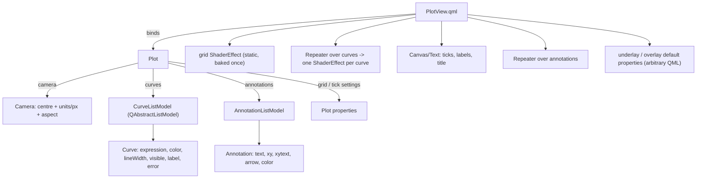

# API design — an infinite canvas on Qt

Status: **decided**. Supersedes the earlier `Figure`/`Axes` framing of this document: those
exist to serve a *bounded canvas with subplots*, and QMLMathPlot has neither.

---

## 1. What this thing actually is

Three facts decide the whole design, and none of them matches Matplotlib's model:

1. **The canvas is infinite.** There is no figure rectangle, no inches, no dpi-bounded page.
   The state is *where you are looking*, not *what the picture contains*.
2. **One view per widget, and the widget keeps changing size.** There are no subplots and no
   axes boxes: several panels are several `Plot` objects in a Qt layout. The visible range is
   therefore a *consequence* of the camera and the current size — never a stored promise.
3. **Artists are shaders.** A curve is an expression evaluated per pixel; the grid is a
   shader; text and vector furniture are QML. There is no artist list to rasterise.

So the model is a **camera on an infinite canvas**, and the Matplotlib flavour is kept only
where it is vocabulary rather than mechanism (§10).

## 2. Object model



`Plot` is a plain `QObject` (no widget, no window): the same plot can be shown in a
`QQuickView`, embedded through `MathPlotWidget`, or rendered offscreen for an export. The
model owns state; `PlotView.qml` owns pixels.

**Why a camera and not limits.** A camera stores `(centre, units-per-pixel, aspect)` — three
numbers that do not depend on the widget at all. The visible range is *derived* from the
camera and the item's own size, which is exactly what an infinite canvas needs:

* resizing shows more or less canvas **at the same zoom** — the natural camera behaviour, not
  a special rule (an earlier limits-based design needed a "keep the scale" patch plus three
  ordering fixes for the same effect);
* the shader derives its mapping from the camera plus its own size, so nothing depends on a
  size report arriving in the right order;
* an export is "render this canvas region at this pixel size", which is the same operation
  with different arguments.

## 3. Python API

```python
from qmlmathplot import Plot

plot = Plot()                          # the canvas + its artists
cam = plot.camera
cam.centre = (0.0, 0.0)                # world coordinates at the middle of the view
cam.zoom = 0.0133                      # world units per pixel (uniform)
cam.aspect = "auto"                    # "auto" | 1.0 | 2.0 …  (units_x per units_y per pixel)
cam.xlim = (-6.0, 6.0)                 # convenience view onto the camera; keeps the ratio
cam.ylim = (-2.0, 2.0)

plot.xlim, plot.ylim = (-6.0, 6.0), (-2.0, 2.0)     # same, forwarded for ergonomics
plot.grid = True
plot.grid_color = "#2a2a3a"
plot.title = "sin(1/x)"
plot.ticks = "auto"                    # "auto" | [(pos, "label"), ...] | None

c1 = plot.add_curve("sin(1/x)", color="#33ccff", line_width=1.5, label="sin(1/x)")
c2 = plot.add_curve("tan(x)", color="#ff8866", label="tan")
c1.expression = "sin(2/x)"             # one signal -> re-bake -> QML swaps the shader
c2.visible = False
plot.remove_curve(c2)

ann = plot.annotate("pole", xy=(0.0, 0.0), xytext=(24, -18), arrow=True)

plot.save_image("out.png", xlim=(-1, 1), ylim=(-1, 1), width=1200, height=400)
img = plot.to_image(width=800, height=600)          # -> QImage

# plt-flavoured one-liner for scripts and notebooks (module-level, no global state):
qmlmathplot.quickplot("sin(1/x)", xlim=(-1, 1), ylim=(-1, 1))
```

Every setter is a Qt `Property` with a `notify` signal, so the same calls work from QML, from
a Qt Designer slot or from a `QTimer`:

```python
QTimer.singleShot(1000, lambda: setattr(c1, "expression", "sin(3/x)"))
```

## 4. QML surface

```qml
import QmlMathPlot 1.0

PlotView {
    plot: myPlot                     // inject the model (or let it create one)
    anchors.fill: parent
    underlay: Item { }               // below the curves; mapToScreen() available
    overlay: Item { }                // above everything (legends, readouts, badges)
}
```

`PlotView` exposes `mapToScreen(x, y)` and `mapFromScreen(point)` so any QML element can sit
at world coordinates without re-deriving the transform.

## 5. The Qt contract (what makes runtime changes free)

| Object | Property | Type | Notify | Effect |
|---|---|---|---|---|
| `Plot` | `camera` | `Camera*` | `cameraChanged` | rebind the view |
| | `curves` | `CurveListModel*` | model signals | `Repeater` adds/removes one ShaderEffect |
| | `annotations` | `AnnotationListModel*` | model signals | `Repeater` adds/removes one Item |
| | `xlim`, `ylim` | `QVector2D` | forwarded from `camera` | convenience; keeps the aspect ratio |
| | `grid`, `gridColor`, `gridWidth` | `bool`, `QColor`, `double` | `gridChanged` | grid shader uniforms only |
| | `ticks` | `QVariant` | `ticksChanged` | tick positions + labels |
| | `title` | `QString` | `titleChanged` | text item |
| `Camera` | `centre` | `QVector2D` | `viewChanged` | everything that reads the view |
| | `zoom` | `double` (units/px) | `viewChanged` | idem |
| | `aspect` | `QVariant` (`"auto"` or number) | `aspectChanged` | the effective zoom on one axis |
| | `xlim`, `ylim` | `QVector2D` | `viewChanged` | derived get/set onto the camera |
| `Curve` | `expression` | `QString` | `expressionChanged` → `shadersChanged` | re-bake (cached), swap `.qsb` |
| | `color`, `lineWidth` | `QColor`, `double` | `styleChanged` | shader uniforms |
| | `visible`, `label` | `bool`, `QString` | `visibleChanged`, `labelChanged` | Repeater visibility; host legend |
| | `error` | `QString` | `errorChanged` | red text; the previous shader stays |
| `Annotation` | `text`, `xy`, `xytext`, `arrow`, `color` | … | `changed` | that one item |

Rules: setters are idempotent and emit only on a real change; a failed expression keeps the
last working shader and fills `error` (never a blank plot); the bake is cached by source hash,
so re-setting the same expression is free, and a new expression is baked on a worker with the
swap happening when `shadersChanged` fires.

## 6. Curves (many of them)

* One `ShaderEffect` per curve, produced by a `Repeater` over `CurveListModel`. Each pass is
  independent: its own expression, colour, width, visibility, bake.
* Cost: **one full-screen fragment pass per visible curve** (the per-pixel work of the README
  times the number of curves). Per-pixel gating keeps each pass cheap where nothing is drawn,
  but the pass is not free, so `visible` is the intended lever; "merge N curves into one
  generated shader" is the documented optimisation if a figure needs many at once (it costs a
  re-bake per curve-count change and a fixed maximum N).
* **Data series are a different artist.** `plot(x, y)` with arrays is a QML-geometry polyline
  (a `Shape`), not a shader — finite data has no aliasing problem and does not need the
  per-pixel machinery. `add_series(x, y)` is reserved for it so `add_curve` never has to
  pretend to accept arrays and silently change how the curve is drawn.

## 7. The camera, ticks and grid

* `zoom` is uniform (world units per pixel) and `aspect` is the ratio of the x unit to the y
  unit in pixels; together they give the two scales. `"auto"` means the scales are whatever
  the widget's shape makes them — the shape then follows the widget.
* `xlim` / `ylim` are *derived* from the camera and the current size, and assigning them
  moves the camera. What an app reads is always what is on screen (the camera is the single
  source of truth, so no second hidden range exists).
* With a numeric `aspect`, changing it **reduces the zoom if necessary so nothing that was
  visible disappears** (expand, never crop) and keeps the centre.
* Panning/zooming never touch the size; resizing never touches the camera. That is the whole
  reason the camera exists.
* Tick *values* are computed in Python (`Camera.tick_values()` — nice-number algorithm, pure
  and unit-tested) and pushed through `ticksChanged`; QML only positions and formats them.
  Labels regenerate on camera changes, not per frame.
* The grid is a **static shader** (tick positions as uniforms): crisp at any zoom, no
  per-frame QML churn, baked once. Tick marks and labels are QML.

## 8. Annotations, labels and custom elements

* `plot.annotate(text, xy=..., xytext=..., arrow=...)` — `xy` in world units, `xytext` an
  offset in pixels, so the label does not move when the camera zooms.
* **No legend is planned, and none is built in.** `Curve.label` exists so a host can build
  one; the natural place is `PlotView.overlay` (a legend is a screen-space element on an
  infinite canvas, not something inside the canvas).
* Everything else is QML: `underlay` / `overlay` are default properties and `mapToScreen()`
  gives the transform — arbitrary QML inside the plot's coordinate space, no Python model.

## 9. Export / screenshots

```python
plot.save_image("out.png", xlim=(-1, 1), ylim=(-1, 1), width=1200, height=400, dpi=1.0)
plot.to_image(width=800, height=600)          # -> QImage
```

This is *not* `savefig`, and it cannot be: there is no figure to re-render at a new dpi. An
export is **"render this region of the infinite canvas at this pixel size"**:

* `xlim` / `ylim` select the canvas region and default to the current view;
  `width` / `height` are the output pixels and default to the live view's size; `dpi` scales
  the pixel size for high-resolution output.
* The requested region is **framed and stretched onto the requested pixel size** — a report
  figure, not a window. An export of `xlim=ylim=(-1,1)` at `1200×400` is 4:1. For square
  units pass a size with the region's ratio.
* Because the region is a parameter, an export can cover *more* canvas than the widget shows
  — something a bounded figure cannot do.
* Implementation (**verified**): a hidden `QQuickWidget` (`WA_DontShowOnScreen`, resized to the
  target, `show()`n offscreen) read back with the synchronous `QQuickWidget.grabFramebuffer()`.
  Verified: `sin(1/x)`, `xlim=ylim=(-1,1)`, 800×200 logical → 1200×300 device pixels with the
  curve stretched 4:1. Dead ends (recorded in AGENTS.md item 26): PySide6 6.11 has no
  `QQuickRenderControl.grab()` and no `QRhi` binding, and `grabToImage()` returns null on a
  never-exposed window.
* `transparent=True` clears to alpha 0; everything else follows the live styling, so an
  export cannot drift from what the user sees.

## 10. How Matplotlib-familiar should this be?

**Verdict: copy the vocabulary, not the mechanism.** The vocabulary (limits, grid, title,
ticks, `annotate`) is a user-facing language: it costs nothing and lets a Matplotlib user
guess right on the first try. The mechanism exists to serve a bounded, subplot-hosting,
imperatively rasterised canvas — none of which we have.

| Matplotlib | Copy? | Why |
|---|---|---|
| `xlim` / `ylim` / `grid` / `title` / `ticks` / `annotate` | **yes** | pure vocabulary; no mechanism attached |
| `aspect` (+ `adjustable`) | **`aspect` yes, `adjustable` no** | `'box'` letterboxing needs an axes box inside a figure; on an infinite canvas the camera just zooms out instead |
| `NavigationToolbar2QT` | **no** | its features assume a rasterising canvas (rubber-band box zoom, blitting), it would have to be written twice (QWidget + QML) and would fight host UI frameworks (qfluentwidgets, RinUI). Expose primitives instead (§13) |
| `Figure` / `Axes` / `subplots()` / `GridSpec` | **no** | they exist to host several axes in one bounded page. We have one view per widget and no page: several panels are a Qt layout of `Plot`s |
| `legend()` | **not planned** | chrome belongs to the host; `Curve.label` + `overlay` is enough |
| `savefig()` | **no, but the same spirit** | a bounded figure can be re-rendered at a new dpi; an infinite canvas needs a *region* (§9) |
| `plot(x, y)` with arrays | **as `add_series`** | a data polyline is a different artist with a different quality path (§6) |
| `FigureCanvas` / `draw()` / `Artist` / `Transform` | **no** | they serve a rasterising backend; we are a live Qt scene, so these would be empty shells and a `draw()` that lies |
| `mpl_connect("button_press_event", …)` | **no** | Qt signals are the runtime's own event system |
| `plt.*` global current figure | **only as `quickplot()`** | scripts want it; applications must not have it |

Litmus test for anything else: *does the name describe a thing the user thinks about (a
region, a label, a file) or a step our renderer performs (draw, blit, rasterise)?* Copy the
first, refuse the second.

## 11. Where we deliberately differ from Matplotlib

| Matplotlib | Here | Why |
|---|---|---|
| bounded figure at a dpi | infinite canvas + camera | panning off the "page" must work; nothing bounds the world |
| several axes per figure | one camera per `Plot`; panels are a Qt layout | layouts already do sizing, spacing and resizing |
| data-space limits as the state | camera (centre/zoom/aspect) as the state, limits derived | the widget resizes constantly; a stored range would have to be patched on every resize |
| artist list redrawn per figure | one QML item per curve, driven by model signals | no redraw loop; Qt owns invalidation |
| transforms stack (data→axes→figure→display) | one camera→item mapping | only one coordinate space exists |
| `savefig(dpi=)` | offscreen render of a canvas region at a size | the plot *is* a Qt scene |
| blocking `show()` | the widget/`PlotView` is a live item | Qt's event loop is the app's |

## 12. Migration from today's code

| Today | Becomes |
|---|---|
| `PlotController` (expression + shaders + view) | `Curve` (expression + shaders + style) and `Camera` (the view) |
| `ViewRect` | `Camera` (centre/zoom/aspect); `xlim`/`ylim` are derived onto it |
| `PlotController.setViewport` | gone: the shader derives its mapping from the camera + its own size, so no size round-trip is needed for drawing |
| `MathPlot.qml` | `PlotView.qml` (grid shader + Repeater + furniture) |
| `MathPlotWidget` | same public shape, backed by `Plot` |
| `DEFAULT_VIEW` | `Camera.home` (centre/zoom as configured) |

Backwards compatibility: `PlotController` and `MathPlot` stay as thin aliases for one release,
marked deprecated in their docstrings; the explorers move to `PlotView` so the new path is the
one that is exercised.

## 13. Host chrome: primitives, not a toolbar

The library ships **no toolbar and no chrome**. A toolbar belongs to the host application (or
to a UI framework it already uses: qfluentwidgets, RinUI, Material, a QML `ToolBar`…). What
the library owes the host is state and actions in Qt's own vocabulary:

| Kind | Members |
|---|---|
| Slots (actions) | `camera.reset()`, `camera.zoom_by(delta, u, v)`, `camera.pan_pixels(dx, dy, w, h)`, `plot.save_image(…)`, `plot.to_image(…)` |
| Properties (state) | `camera.centre`, `camera.zoom`, `camera.aspect`, `camera.xlim`, `camera.ylim`, `plot.grid`, … — readable *and* writable, each with a notify signal |
| Signals (events) | `viewChanged`, `aspectChanged`, `gridChanged`, … one per property |
| Helpers | `PlotView.mapToScreen(x, y)` / `mapFromScreen(point)` |

That set is enough for chrome without the library guessing at it:

```python
home_button.clicked.connect(camera.reset)        # any framework: PySide signal -> Slot
```

```qml
Button { text: "Home"; onClicked: camera.reset() }   // any QML UI framework
```

Two consequences worth stating:

* **Box zoom / rubber band is not a library feature, and needs nothing new.** A host reads the
  two corners with `mapFromScreen()` and assigns `camera.xlim` / `camera.ylim`; that *is* the
  zoom. No mode, overlay or cursor is shipped, because the host owns its input gestures.
* **A view history is the host's ten lines.** `xlim` / `ylim` are readable and `viewChanged`
  fires on every change, so back/forward is `stack.append((camera.centre, camera.zoom))` plus
  an assignment.

## 14. Interaction model

* Wheel = zoom, anchored at the cursor, multiplicative `zoomStep` (0.9/notch, so up and down
  are exact inverses). Drag = pan, 1:1 with the cursor.
* Both are **on by default** (a plot that works out of the box) and both are switchable:
  `camera.panEnabled`, `camera.zoomEnabled`, plus `zoomStep`. A host that needs the wheel for
  its own scrolling turns zoom off; a host that wants Ctrl+wheel binds it itself.
* The anchor is a parameter of the slot (`zoom_by(delta, u, v)`), so a host can zoom about the
  centre or about a keyboard-driven cursor without us inventing a mode.
* **No autoscale.** An expression has no sample set to autoscale from, and sampling one on the
  CPU would contradict the per-pixel model. This is the Desmos model: a fixed home view that
  you pan and zoom.
* `camera.reset()` returns to `home` (the camera as configured), not to a hard-coded default.

## 15. Build order

1. `Camera` + `Curve` split out of `PlotController`; `PlotView.qml` renders one curve, the
   shader takes the camera (no size round-trip for drawing). No visual change; existing tests
   keep passing.
2. `CurveListModel` + `Repeater` → multiple curves, per-curve visibility.
3. Grid shader + ticks + labels + title.
4. `AnnotationListModel` + `underlay`/`overlay` + `mapToScreen`.
5. Offscreen exporter (`to_image` / `save_image`) + its tests (region, size, stretch,
   transparency).
6. Deprecation shims removed.

Each step is independently shippable and testable; steps 1–2 change existing files, the rest
are additive.
