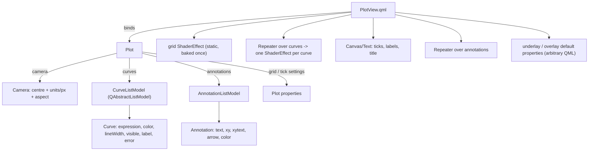

# API design — an infinite canvas on Qt

Status: **decided**; supersedes the earlier `Figure`/`Axes` framing of this document: those
exist to serve a *bounded canvas with subplots*, and QMLMathPlot has neither.

**Implemented** (see the build order): §2–§7 — `Plot` / `Camera` / `Curve` / `CurveListModel`,
multiple curves, grid, axes, ticks, titles, the theme system (§7b) — and §9, the export
including the matplotlib hand-off.
**Not implemented yet**: §8 annotations and `underlay`/`overlay`, plus the rest of the gap list
in §11.2 (the vector-output row left it when the hand-off landed) (which is the honest comparison against Matplotlib — verified by grepping the code, not
recalled). Everything else in this document is the plan of record, not a description of the
current code.

---

## 1. What this thing actually is

Three facts decide the whole design, and none of them matches Matplotlib's model:

1. **The canvas is infinite.** There is no figure rectangle, no inches, no dpi-bounded page.
   The state is *where you are looking*, not *what the picture contains*.
2. **One view per widget, and the widget keeps changing size.** There are no subplots and no
   axes boxes: several panels are several `Plot` objects in a Qt layout. The visible range is
   therefore a *consequence* of the camera and the current size — never a stored promise.
3. **Artists are shaders.** A curve is an expression evaluated per pixel; the grid is a
   shader; text and vector furniture are QML. There is no artist list to rasterise.

So the model is a **camera on an infinite canvas**, and the Matplotlib flavour is kept only
where it is vocabulary rather than mechanism (§10).

## 2. Object model



`Plot` is a plain `QObject` (no widget, no window): the same plot can be shown in a
`QQuickView`, embedded through `MathPlotWidget`, or rendered offscreen for an export. The
model owns state; `PlotView.qml` owns pixels.

**Why a camera and not limits.** A camera stores `(centre, units-per-pixel, aspect)` — three
numbers that do not depend on the widget at all. The visible range is *derived* from the
camera and the item's own size, which is exactly what an infinite canvas needs:

* resizing shows more or less canvas **at the same zoom** — the natural camera behaviour, not
  a special rule (an earlier limits-based design needed a "keep the scale" patch plus three
  ordering fixes for the same effect);
* the shader derives its mapping from the camera plus its own size, so nothing depends on a
  size report arriving in the right order;
* an export is "render this canvas region at this pixel size", which is the same operation
  with different arguments.

## 3. Python API

```python
from qmlmathplot import Plot

plot = Plot()                          # the canvas + its artists
cam = plot.camera
cam.centre = (0.0, 0.0)                # world coordinates at the middle of the view
cam.zoom = 0.0133                      # world units per pixel (uniform)
cam.aspect = "auto"                    # "auto" | 1.0 | 2.0 …  (units_x per units_y per pixel)
cam.xlim = (-6.0, 6.0)                 # convenience view onto the camera; keeps the ratio
cam.ylim = (-2.0, 2.0)

plot.xlim, plot.ylim = (-6.0, 6.0), (-2.0, 2.0)     # same, forwarded for ergonomics
plot.grid = True
plot.grid_color = "#2a2a3a"
plot.title = "sin(1/x)"
plot.ticks = "auto"                    # "auto" | [(pos, "label"), ...] | None

c1 = plot.add_curve("sin(1/x)", color="#33ccff", line_width=1.5, label="sin(1/x)")
c2 = plot.add_curve("tan(x)", color="#ff8866", label="tan")
c1.expression = "sin(2/x)"             # one signal -> re-bake -> QML swaps the shader
c2.visible = False
plot.remove_curve(c2)

ann = plot.annotate("pole", xy=(0.0, 0.0), xytext=(24, -18), arrow=True)

plot.save_image("out.png", xlim=(-1, 1), ylim=(-1, 1), width=1200, height=400)
img = plot.to_image(width=800, height=600)          # -> QImage

# plt-flavoured one-liner for scripts and notebooks (module-level, no global state):
qmlmathplot.quickplot("sin(1/x)", xlim=(-1, 1), ylim=(-1, 1))
```

Every setter is a Qt `Property` with a `notify` signal, so the same calls work from QML, from
a Qt Designer slot or from a `QTimer`:

```python
QTimer.singleShot(1000, lambda: setattr(c1, "expression", "sin(3/x)"))
```

## 4. QML surface

```qml
import QmlMathPlot 1.0

PlotView {
    plot: myPlot                     // inject the model (or let it create one)
    anchors.fill: parent
    underlay: Item { }               // below the curves; mapToScreen() available
    overlay: Item { }                // above everything (legends, readouts, badges)
}
```

`PlotView` exposes `mapToScreen(x, y)` and `mapFromScreen(point)` so any QML element can sit
at world coordinates without re-deriving the transform.

## 5. The Qt contract (what makes runtime changes free)

| Object | Property | Type | Notify | Effect |
|---|---|---|---|---|
| `Plot` | `camera` | `Camera*` | `cameraChanged` | rebind the view |
| | `curves` | `CurveListModel*` | model signals | `Repeater` adds/removes one ShaderEffect |
| | `annotations` | `AnnotationListModel*` | model signals | `Repeater` adds/removes one Item |
| | `xlim`, `ylim` | `QVector2D` | forwarded from `camera` | convenience; keeps the aspect ratio |
| | `grid`, `gridColor`, `gridWidth` | `bool`, `QColor`, `double` | `gridChanged` | grid shader uniforms only |
| | `ticks` | `QVariant` | `ticksChanged` | tick positions + labels |
| | `title` | `QString` | `titleChanged` | text item |
| `Camera` | `centre` | `QVector2D` | `viewChanged` | everything that reads the view |
| | `zoom` | `double` (units/px) | `viewChanged` | idem |
| | `aspect` | `QVariant` (`"auto"` or number) | `aspectChanged` | the effective zoom on one axis |
| | `xlim`, `ylim` | `QVector2D` | `viewChanged` | derived get/set onto the camera |
| `Curve` | `expression` | `QString` | `expressionChanged` → `shadersChanged` | re-bake (cached), swap `.qsb` |
| | `color`, `lineWidth` | `QColor`, `double` | `styleChanged` | shader uniforms |
| | `visible`, `label` | `bool`, `QString` | `visibleChanged`, `labelChanged` | Repeater visibility; host legend |
| | `error` | `QString` | `errorChanged` | red text; the previous shader stays |
| `Annotation` | `text`, `xy`, `xytext`, `arrow`, `color` | … | `changed` | that one item |

Rules: setters are idempotent and emit only on a real change; a failed expression keeps the
last working shader and fills `error` (never a blank plot); the bake is cached by source hash,
so re-setting the same expression is free, and a new expression is baked on a worker with the
swap happening when `shadersChanged` fires.

## 6. Curves (many of them)

* One `ShaderEffect` per curve, produced by a `Repeater` over `CurveListModel`. Each pass is
  independent: its own expression, colour, width, visibility, bake.
* Cost: **one full-screen fragment pass per visible curve** (the per-pixel work of the README
  times the number of curves). Per-pixel gating keeps each pass cheap where nothing is drawn,
  but the pass is not free, so `visible` is the intended lever; "merge N curves into one
  generated shader" is the documented optimisation if a figure needs many at once (it costs a
  re-bake per curve-count change and a fixed maximum N).
* **Data series are a different artist.** `plot(x, y)` with arrays is a QML-geometry polyline
  (a `Shape`), not a shader — finite data has no aliasing problem and does not need the
  per-pixel machinery. `add_series(x, y)` is reserved for it so `add_curve` never has to
  pretend to accept arrays and silently change how the curve is drawn.

## 7. The camera, ticks and grid

* `zoom` is uniform (world units per pixel) and `aspect` is the ratio of the x unit to the y
  unit in pixels; together they give the two scales. `"auto"` means the scales are whatever
  the widget's shape makes them — the shape then follows the widget.
* `xlim` / `ylim` are *derived* from the camera and the current size, and assigning them
  moves the camera. What an app reads is always what is on screen (the camera is the single
  source of truth, so no second hidden range exists).
* With a numeric `aspect`, changing it **reduces the zoom if necessary so nothing that was
  visible disappears** (expand, never crop) and keeps the centre.
* Panning/zooming never touch the size; resizing never touches the camera. That is the whole
  reason the camera exists.
* Tick *values* are computed in Python (`Camera.tick_values()` — nice-number algorithm, pure
  and unit-tested) and pushed through `ticksChanged`; QML only positions and formats them.
  Labels regenerate on camera changes, not per frame.
* The axes are drawn **through the origin** by default (`axes_position = "zero"`): the x-axis
  is the horizontal line at world y=0, the y-axis the vertical at x=0, and the tick marks and
  labels sit on them. When 0 is outside the visible range that axis sticks to the nearest edge,
  so labels are never lost while panning (`"edge"` restores the old edge-pinned behaviour).
* The grid, axes, tick marks and labels are **drawn in QML** (a `Canvas`/`Shape` regenerated
  when the camera changes). Simple and crisp enough for the tens of lines a grid has; moving it
  into a static shader (tick positions as uniforms, baked once) stays the documented
  optimisation if a figure ever needs many lines.

## 7b. Themes

The style system copies Matplotlib's, because that is where the good defaults live and it
costs nothing to be compatible with them: a theme is a set of style overrides, and the
bundled ones are **Matplotlib's own style sheets, vendored verbatim** into
`qmlmathplot/themes/*.mplstyle` (26 files, redistributed under Matplotlib's BSD license — see
`themes/LICENSE.matplotlib`), converted at load time.

```python
plot.theme = "ggplot"
plot.theme = "dark_background"
plot.theme = "seaborn-v0_8-darkgrid"
plot.theme = "my-style"                 # themes/my-style.mplstyle
plot.theme = "path/to/any.mplstyle"     # any file in the same format
qmlmathplot.themes.names()              # everything available
```

The file format is Matplotlib's (`key: value`, `#` comments), so a new style sheet can be
dropped in without touching code. ``"default"`` is Matplotlib's own default style
(`themes/default.mplstyle`, written out because Matplotlib keeps its defaults in `rcParams`
rather than in a stylelib file); a plot with no theme applied uses exactly those values, so
`plot.theme = "default"` is a reset and the out-of-the-box look is a matplotlib look. `themes.resolve(name)` converts `rcParams` into our
property names:

| Matplotlib | Plot property |
|---|---|
| `axes.facecolor` (else `figure.facecolor`) | `background` |
| `axes.grid` | `grid` |
| `axes.edgecolor` / `axes.linewidth` | `axisColor` / `axisWidth` (the axes drawn through the origin) |
| `grid.color` / `grid.linewidth` / `grid.alpha` / `grid.linestyle` | `gridColor` / `gridWidth` / `gridAlpha` / `gridStyle` |
| `axes.prop_cycle` | `colorCycle` |
| `lines.linewidth` | `lineWidth` (default for new curves) |
| `text.color`, `axes.labelcolor` | `textColor` |
| `xtick.color`, `ytick.color` | `tickColor` |
| `xtick.major.size`, `ytick.major.size` | `tickLength` |
| `font.size` | `fontSize` |
| `xtick.labelsize`, `ytick.labelsize` | `tickFontSize` |
| `axes.titlecolor` / `axes.titlesize` / `axes.titleweight` | `titleColor` / `titleFontSize` / `titleBold` |

Values are converted the way Matplotlib reads them: points become logical pixels (×4/3),
`w`/`k` short names, bare hex (`E5E5E5`), float grayscale (`0.8`) and `C0`… cycle references
are all accepted. Keys describing things this library does not have (spines, figure size,
dpi, legend, marker styles) are dropped silently, which is what makes dropping in an
unmodified `.mplstyle` work.

Themes set the *defaults* for new artists and the plot's own furniture; an explicit
`add_curve(color=...)` still wins, and nothing is global — a theme belongs to one `Plot`.

## 8. Annotations, labels and custom elements

* `plot.annotate(text, xy=..., xytext=..., arrow=...)` — `xy` in world units, `xytext` an
  offset in pixels, so the label does not move when the camera zooms.
* **No legend is planned, and none is built in.** `Curve.label` exists so a host can build
  one; the natural place is `PlotView.overlay` (a legend is a screen-space element on an
  infinite canvas, not something inside the canvas).
* Everything else is QML: `underlay` / `overlay` are default properties and `mapToScreen()`
  gives the transform — arbitrary QML inside the plot's coordinate space, no Python model.

## 9. Export / screenshots

An export takes **two independent parameter sets** and reconciles them:

```python
plot.savefig("out.png", xlim=(-1, 1), ylim=(-1, 1), width=1200, height=400)
plot.savefig("hi.png", dpi=2.0)                      # the live view, twice the pixels
img = plot.to_image(width=800, height=600)           # -> QImage
```

* **The canvas range** — `xlim` / `ylim` — defaults to the *camera*: the same centre and the
  same scale (world units per pixel) as the live view, extended to the export's size. The
  camera makes this trivial, which is one of the reasons it is the state.
* **The image size** — `width` / `height` — defaults to the live view's size, and is in *device*
  pixels: the offscreen view is sized `width / devicePixelRatio` logically so the grabbed image
  is exactly `width` × `height`. `dpi` multiplies it for high-resolution output.

### Reconciliation (`adjustable`)

Matplotlib does not have this problem in the same form: a figure has a fixed size, the axes
occupy a sub-rectangle of it, and the data is mapped into that rectangle — so the range always
fits, at the price of margins, and `set_aspect(..., adjustable='box'|'datalim')` chooses whether
the box or the limits give way. **We have no axes box** (the plot fills its item, an explicit
earlier requirement), so the two parameter sets can genuinely disagree and the library must be
told which one wins:

The parameter is named after Matplotlib's and its **default is Matplotlib's default**
(`rcParams["axes.adjustable"]` = `"box"`), because that is the mode that never distorts:

| `adjustable` | What happens | Matplotlib analogue |
|---|---|---|
| `"box"` (**default**) | one scale, taken from the live unit ratio, and the **largest** one for which the requested range still fits: the binding axis is exact, the other keeps background margins. Nothing is ever cropped | `adjustable="box"` (its default) |
| `"datalim"` | the camera's own scale is used and the limits *expand* (never cropped) to fill the size | `adjustable="datalim"` |
| `"stretch"` | the requested range maps onto the requested size exactly — the two scales are independent, so a mismatched aspect **distorts** | none; ours, for the "report figure" case |

So the default honours the *aspect* and pads, exactly as Matplotlib does; a report figure that
must fill the frame asks for `adjustable="stretch"` explicitly and accepts the distortion.
Cropping is deliberately not offered: it silently loses visible content, which no other mode
does. With no explicit range all three modes agree — the range is derived from the camera at
the export size, so it already has that size's aspect.

Because the region is a parameter, an export can cover **more** canvas than the widget shows —
something a bounded figure cannot do.

### Offscreen rendering

A hidden `QQuickWidget` (`WA_DontShowOnScreen`, `setResizeMode(SizeRootObjectToView)`, resized
to the target, `show()`n offscreen) with the figure attached and the limits set, read back with
the synchronous `QQuickWidget.grabFramebuffer()`. Verified: `sin(1/x)`, `xlim=ylim=(-1,1)`,
800×200 logical → 1200×300 device pixels with the curve stretched 4:1.

Dead ends, recorded so they are not retried (AGENTS.md item 26): PySide6 6.11 has no
`QQuickRenderControl.grab()` and no `QRhi` binding, and `QQuickItem.grabToImage()` returns
**null** on a window that was never exposed.

`transparent=True` clears to alpha 0; everything else follows the live styling, so an export
cannot drift from what the user sees.

### Hand-off to matplotlib (and sympy's plotting)

The Qt path above is the *only* renderer this library has, and curves are shader-rendered, so
they have no vector form (§11.3). For vector output and for matplotlib's ecosystem there is a
second, explicitly separate path:

```python
fig = plot.to_matplotlib()          # -> matplotlib.figure.Figure, one Axes, headless
                                    #    (Figure + FigureCanvasAgg: no pyplot, no GUI
                                    #     backend, so it works with no QApplication at all)
plot.savefig("out.svg", backend="matplotlib")
sp = plot.to_sympy()                # -> sympy.plotting.Plot
```

**matplotlib is not a dependency.** It is an optional extra
(`pip install qmlmathplot[matplotlib]`), imported lazily by these methods, which raise a clear
error naming the extra when it is missing — the same arrangement sympy uses for its own
plotting.

This path **samples** each expression into arrays, so it is a different renderer with different
guarantees: oscillating functions alias (the very thing the Qt renderer exists to avoid), the
look will not match (Qt fonts and antialiasing vs matplotlib's), and only the style properties
that map are carried over. SymPy does not solve the oscillation either, and its adaptive mode
does not help: measured on `sin(1/x)` over [-1, 1], `adaptive=True` produced **289** points
(fewer than a fixed 2000), no warning in sympy 1.14, and the same block of vertical connectors.
The difference is how the two fail — a sampled renderer draws an artefact, the Qt renderer draws
the envelope the data supports. Its value is vector output (SVG/PDF) and matplotlib's ecosystem —
nothing else.

## 10. How Matplotlib-familiar should this be?

**Verdict: copy the vocabulary, not the mechanism.** The vocabulary (limits, grid, title,
ticks, `annotate`) is a user-facing language: it costs nothing and lets a Matplotlib user
guess right on the first try. The mechanism exists to serve a bounded, subplot-hosting,
imperatively rasterised canvas — none of which we have.

| Matplotlib | Copy? | Why |
|---|---|---|
| `xlim` / `ylim` / `grid` / `title` / `ticks` / `annotate` | **yes** | pure vocabulary; no mechanism attached |
| `aspect` (+ `adjustable`) | **`aspect` yes, `adjustable` no** | `'box'` letterboxing needs an axes box inside a figure; on an infinite canvas the camera just zooms out instead |
| `NavigationToolbar2QT` | **no** | its features assume a rasterising canvas (rubber-band box zoom, blitting), it would have to be written twice (QWidget + QML) and would fight host UI frameworks (qfluentwidgets, RinUI). Expose primitives instead (§13) |
| `Figure` / `Axes` / `subplots()` / `GridSpec` | **no** | they exist to host several axes in one bounded page. We have one view per widget and no page: several panels are a Qt layout of `Plot`s |
| `legend()` | **not planned** | chrome belongs to the host; `Curve.label` + `overlay` is enough |
| `savefig()` | **no, but the same spirit** | a bounded figure can be re-rendered at a new dpi; an infinite canvas needs a *region* (§9) |
| `plot(x, y)` with arrays | **as `add_series`** | a data polyline is a different artist with a different quality path (§6) |
| `FigureCanvas` / `draw()` / `Artist` / `Transform` | **no** | they serve a rasterising backend; we are a live Qt scene, so these would be empty shells and a `draw()` that lies |
| `mpl_connect("button_press_event", …)` | **no** | Qt signals are the runtime's own event system |
| `plt.*` global current figure | **only as `quickplot()`** | scripts want it; applications must not have it |

Litmus test for anything else: *does the name describe a thing the user thinks about (a
region, a label, a file) or a step our renderer performs (draw, blit, rasterise)?* Copy the
first, refuse the second.

## 11. How this compares to Matplotlib today

Three kinds of difference, and which is which matters: **by design** (the model does not have
that concept), **reasonable gap** (it fits the model and is simply not built), and
**fundamental** (the renderer cannot, or the model deliberately has no such thing).

### 11.1 By design

| Matplotlib | Here | Why |
|---|---|---|
| bounded figure at a dpi | infinite canvas + camera | panning off the "page" must work; nothing bounds the world |
| `Figure` / `Axes` / `subplots()` / `GridSpec` | one `Plot` per widget; panels are a Qt layout | there is no page and no axes box; layouts already size, space and resize |
| data-space limits as the state | camera (centre/zoom/aspect) as the state, limits derived | the widget resizes constantly; a stored range would need a patch per resize |
| `plt.*` global current figure | explicit objects | a Qt app has many plots and no global state |
| `plot(x, y)` with data arrays as the native artist | `add_curve("f(x)")` — a fragment shader | the renderer evaluates the expression per pixel |
| artist list redrawn per figure | one QML item per curve, driven by model signals | Qt owns invalidation; no redraw loop |
| transforms stack (data→axes→figure→display) | one camera→item mapping | only one coordinate space exists |
| `savefig(dpi=)` re-rendering the figure | offscreen render of a canvas region at a size | the plot *is* a Qt scene, and the region is a parameter |
| `NavigationToolbar2QT`, rubber band, box zoom | host chrome: `mapFromScreen()` + `xlim`/`ylim` *is* the zoom | two toolkits to maintain; it clashes with host UI frameworks |
| legend | `Curve.label` + `PlotView.overlay` | a legend is screen-space chrome |
| four spines | two axes through the origin, edge-clamped | a function plotter wants the axes where the maths is |
| `draw()` / `FigureCanvas` / blitting | nothing — the scene is live | an API that lies about how pixels appear |
| `rcParams` global state | one `Theme` per `Plot`, loaded from Matplotlib's own style sheets | no global state in a Qt app |
| blocking `show()` | the widget / `PlotView` is a live item | Qt's event loop is the app's |

### 11.2 Reasonable gaps (they fit the model; not built yet)

| Missing | Note |
|---|---|
| `xlabel` / `ylabel` | cheap; `title` exists already |
| `quickplot()` | the `plt.plot`-flavoured one-liner; designed |
| `add_series(x, y)` | data polylines as a QML-geometry artist; designed (§6) |
| `annotate()` / `text()` | designed (§8) |
| settable ticks (`plot.ticks`) | designed; automatic nice-number ticks already work |
| **log axes** | needs a non-linear camera→item mapping in the shader; common enough to matter |
| markers / `scatter` | a different artist (points, not a stroke) |
| minor ticks, tick formatters | the tick machinery is already in Python |
| `fill_between`, spans, bars | QML geometry, like `add_series` |
| `bbox_inches="tight"` | trim an export to the drawn extent |
| more style keys (font family, cycler over line style/marker) | the converter drops what it cannot map |
| style *stacking* (`with plt.style.context([...])`) | one theme per `Plot` today |

### 11.3 Fundamental

* **Curves are shader-rendered, so they have no vector form.** An export from the Qt renderer
  would embed a raster. The way to vector output is the matplotlib hand-off (§9), which samples
  the expression instead — a different renderer with different guarantees, not the same
  picture in another format.
* **Cost is pixels × curves**, not data points: every visible curve is a full-screen pass, so
  many curves at once are expensive and a large window costs more. Matplotlib pays per point.
* **Data arrays are a guest artist, not the native path** (11.2); expressions are native.
* **No 3D, no images, no contours, no statistics** — this is a function plotter.

The other side of the same design: oscillating functions do not alias (the envelope band),
deep zoom stays exact (no polyline resampling), and a pole is a gap rather than a connector.

### 11.4 What we have that Matplotlib's Qt backend does not

* A Qt property with a notify signal for *every* knob: a change is one signal, there is no
  `draw()` to call.
* One live item that embeds both ways — `MathPlotWidget` in QtWidgets, `PlotView` in Qt Quick.
* Cursor-anchored wheel zoom and 1:1 drag pan out of the box, each with a switch.
* An infinite canvas: pan/zoom off the page, and an export may cover more canvas than the
  widget shows.
* Matplotlib's own style sheets, applied per plot (26 of them, plus its default).

## 12. Migration from today's code

| Today | Becomes |
|---|---|
| `PlotController` (expression + shaders + view) | `Curve` (expression + shaders + style) and `Camera` (the view) |
| `ViewRect` | `Camera` (centre/zoom/aspect); `xlim`/`ylim` are derived onto it |
| `PlotController.setViewport` | gone: the shader derives its mapping from the camera + its own size, so no size round-trip is needed for drawing |
| `MathPlot.qml` | `PlotView.qml` (grid shader + Repeater + furniture) |
| `MathPlotWidget` | same public shape, backed by `Plot` |
| `DEFAULT_VIEW` | `Camera.home` (centre/zoom as configured) |

There is **no compatibility layer**: `PlotController`, `ViewRect` and `MathPlot.qml` were
deleted and every caller (widget, CLI, demos, tests) migrated in the same change. For a
single-curve caller the rename is mechanical (`controller.expression` →
`plot.curves.at(0).expression`), and `Camera` replaces `ViewRect` one-for-one.

## 13. Host chrome: primitives, not a toolbar

The library ships **no toolbar and no chrome**. A toolbar belongs to the host application (or
to a UI framework it already uses: qfluentwidgets, RinUI, Material, a QML `ToolBar`…). What
the library owes the host is state and actions in Qt's own vocabulary:

| Kind | Members |
|---|---|
| Slots (actions) | `camera.reset()`, `camera.zoom_by(delta, u, v)`, `camera.pan_pixels(dx, dy, w, h)`, `plot.save_image(…)`, `plot.to_image(…)` |
| Properties (state) | `camera.centre`, `camera.zoom`, `camera.aspect`, `camera.xlim`, `camera.ylim`, `plot.grid`, … — readable *and* writable, each with a notify signal |
| Signals (events) | `viewChanged`, `aspectChanged`, `gridChanged`, … one per property |
| Helpers | `PlotView.mapToScreen(x, y)` / `mapFromScreen(point)` |

That set is enough for chrome without the library guessing at it:

```python
home_button.clicked.connect(camera.reset)        # any framework: PySide signal -> Slot
```

```qml
Button { text: "Home"; onClicked: camera.reset() }   // any QML UI framework
```

Two consequences worth stating:

* **Box zoom / rubber band is not a library feature, and needs nothing new.** A host reads the
  two corners with `mapFromScreen()` and assigns `camera.xlim` / `camera.ylim`; that *is* the
  zoom. No mode, overlay or cursor is shipped, because the host owns its input gestures.
* **A view history is the host's ten lines.** `xlim` / `ylim` are readable and `viewChanged`
  fires on every change, so back/forward is `stack.append((camera.centre, camera.zoom))` plus
  an assignment.

## 14. Interaction model

* Wheel = zoom, anchored at the cursor, multiplicative `zoomStep` (0.9/notch, so up and down
  are exact inverses). Drag = pan, 1:1 with the cursor.
* Both are **on by default** (a plot that works out of the box) and both are switchable:
  `camera.panEnabled`, `camera.zoomEnabled`, plus `zoomStep`. A host that needs the wheel for
  its own scrolling turns zoom off; a host that wants Ctrl+wheel binds it itself.
* The anchor is a parameter of the slot (`zoom_by(delta, u, v)`), so a host can zoom about the
  centre or about a keyboard-driven cursor without us inventing a mode.
* **No autoscale.** An expression has no sample set to autoscale from, and sampling one on the
  CPU would contradict the per-pixel model. This is the Desmos model: a fixed home view that
  you pan and zoom.
* `camera.reset()` returns to `home` (the camera as configured), not to a hard-coded default.

## 15. Build order

1. `Camera` + `Curve` split out of `PlotController`; `PlotView.qml` renders one curve, the
   shader takes the camera (no size round-trip for drawing). No visual change; existing tests
   keep passing.
2. `CurveListModel` + `Repeater` → multiple curves, per-curve visibility.
3. Grid shader + ticks + labels + title.
4. `AnnotationListModel` + `underlay`/`overlay` + `mapToScreen`.
5. **Themes**: the style properties, `plot.theme`, `themes.resolve()` and the vendored
   Matplotlib style sheets (done alongside step 1).
6. Offscreen exporter (`to_image` / `save_image`) — **shelved** (§9).
7. Deprecation shims removed.

Each step is independently shippable and testable; steps 1–2 change existing files, the rest
are additive.
